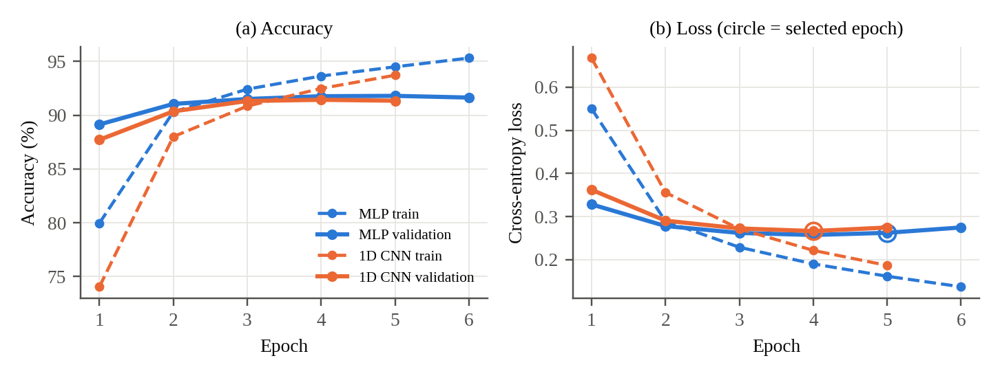
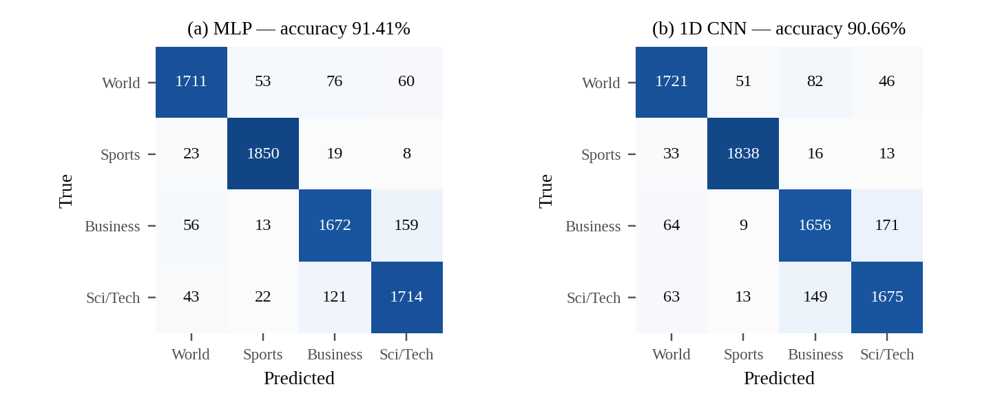

# Comparative Analysis of Deep Learning Architectures for AG News Topic Classification

ICT 4442 Deep Learning Mini Project — School of Computer Engineering, MIT Manipal.

We compare four architecture families on the AG News 4-class topic classification
benchmark (World, Sports, Business, Sci/Tech) under one preprocessing pipeline, one
data split and one evaluation protocol.

## Team

| Member | Reg. No. | Model | Other responsibilities |
|---|---|---|---|
| Siya Srivastava | 230911090 | Model 1 — MLP | Data acquisition, text cleaning, preprocessing pipeline |
| Urvi Kedar Mapsenkar | 230911538 | Model 2 — 1D CNN | Vocabulary, encoding, split statistics |
| Nehal Rai | 230911082 | Model 3 — BiLSTM | Common training/evaluation script, error analysis |
| Aanyaa Agarwwal | 230953040 | Model 4 — Transformer encoder | Figures, documentation |

## Status (interim submission)

| Model | Status | Test accuracy | Macro F1 |
|---|---|---|---|
| MLP | Implemented and evaluated (untuned) | 91.41% | 0.914 |
| 1D CNN | Implemented and evaluated (untuned) | 90.66% | 0.907 |
| BiLSTM | Code drafted, training pending | — | — |
| Transformer encoder | Code drafted, training pending | — | — |

Test set: the official 7,600 AG News test samples, used once. Full metrics, per-class
scores, confusion matrices and per-epoch history are in `results/*.json`.




## Repository layout

```
scripts/download_data.py   download the AG News CSV files into data/
src/text_utils.py          loading, cleaning, tokenisation
src/vocab.py               vocabulary (train split only), encoding, split statistics
src/preprocess.py          full pipeline -> processed/*.npz, vocab.json, stats.json
src/models/mlp.py          Model 1: mean-pooled embeddings + fully connected layers
src/models/cnn.py          Model 2: Conv1d with kernel sizes 3/4/5 + max-over-time pooling
src/models/bilstm.py       Model 3: BiLSTM + max pooling (draft)
src/models/transformer.py  Model 4: Transformer encoder + mean pooling (draft)
src/train.py               common training and evaluation protocol
src/error_analysis.py      confusion pairs and shared errors across models
src/make_figures.py        training curves and confusion matrices
results/                   metrics (JSON) and training logs
figures/                   figures used in the report
```

## How to run

```bash
pip install -r requirements.txt
python scripts/download_data.py
python src/preprocess.py
python src/train.py --model mlp --epochs 6
python src/train.py --model cnn --epochs 5
python src/error_analysis.py
python src/make_figures.py
```

All commands are run from the repository root. The MLP trains in about 1–2 minutes and the
CNN in about 6–8 minutes on a 2-core CPU.

## Pipeline and protocol

- **Data:** AG News (Zhang et al., 2015): 120,000 training and 7,600 test samples, 4 balanced classes.
- **Preprocessing:** title + description joined; HTML entities, URLs and punctuation removed; lower-cased;
  regex word tokenisation.
- **Split:** official training set split 90/10 into train (108,000) and validation (12,000), stratified, seed 42.
- **Encoding:** vocabulary of 30,000 words built from the train split only; sequences padded/truncated to 64 tokens.
- **Training:** Adam (lr 1e-3), batch size 128, cross-entropy loss, seed 42, embeddings trained from scratch;
  best epoch selected on validation accuracy.
- **Metrics:** accuracy, macro precision/recall/F1, per-class scores, confusion matrix.

## External code and AI tools

Libraries: PyTorch, scikit-learn, pandas, NumPy, Matplotlib. The dataset is the public AG News CSV release.
See the project report for the team's declaration on AI-tool use.
